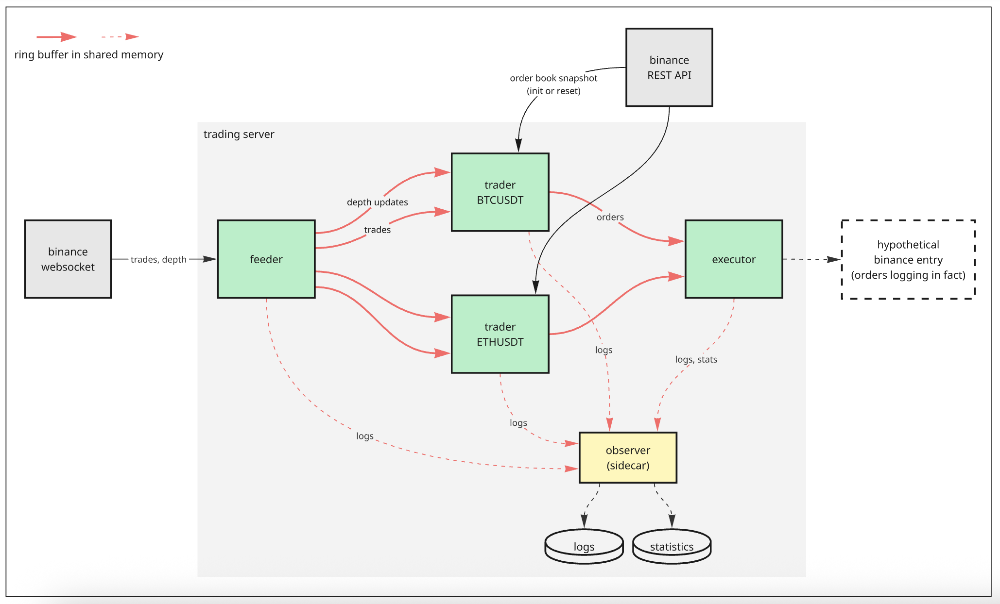

# HFT-style trading demo

A multi-process demo of an HFT-style trading stack: it streams live Binance market data, maintains in-memory order books, runs naive per-symbol strategy logic, and routes orders through a dedicated executor. Processes communicate via POSIX shared memory (SHM) and lock-free single-producer/single-consumer (SPSC) ring buffers. The design targets low-latency practice: cache-friendly shared layouts, no allocations or disk I/O on the hot path, and tick-to-trade–style latency (demo stack; excludes network RTT to the live exchange) measured with monotonic timestamps.

This is a learning project, not production trading software.

---

## Architecture



| Process | Role |
|--------|------|
| feeder | Input gateway. Connects to Binance combined streams (depth + trades) via WebSocket (`stream.binance.com`), parses JSON, publishes order-book deltas and trades into per-symbol SPSC rings in SHM. |
| trader | Implements trading logic. One process per symbol (`trader_btcusdt`, `trader_ethusdt`), all using the same configurable binary. Fetches an order-book snapshot via the Binance REST API when the local book must be reset (gap/corruption). Reads depth updates and trades from the feeder, maintains a local order book, and applies a trade-flow window. Implements a naive rule: buy at the best ask when the top-five levels are bid-skewed (~>55% of bid+ask size) and aggressive buys lead the flow window; sell at the best bid under the mirror skew; skip if a new order matches the previous one. Emits orders into an SPSC ring toward the executor. |
| executor | Output gateway. Consumes orders from both traders, simulates exchange acceptance (no live REST order placement), logs structured hot-path output, and pushes latency samples (steady-clock delta) to a dedicated SHM ring for the observer. |
| observer | Sidecar used for cold-path operations. Drains hot-path log rings from feeder, traders, and executor into plain log files; aggregates latency samples into rolling batches, writes CSV percentiles, and uses logrotate-friendly behaviour (append + truncate recovery). |

---

## Core libraries

| Area | Location | Notes |
|------|-----------|--------|
| Shared memory | `lib/interprocess/shared_memory.hpp` | Thin wrapper over `boost::interprocess::shared_memory_object` plus `mapped_region`. Creates or maps templated objects in the shared segment. Uses a magic + version header so all processes agree on layout. Supports producer liveness checks via a heartbeat. |
| SPSC ring buffer | `lib/interprocess/spsc_ring_buffer.hpp` | Single-producer, single-consumer ring buffer with a cache-line–aware layout. Can disable or reset a lagging consumer to avoid overflow and corrupted reads. |
| Binance protocol | `lib/binance/*` | WebSocket client, REST client, and JSON parser for Binance stream messages. |
| Local order book | `lib/local_order_book.hpp` | Incremental depth application + snapshot recovery hooks. Uses `last_update_id` to maintain consistency. Exposes the top-N bid/ask levels. |
| Trade statistics | `lib/trade_flow_window.*` | Windowed flow metrics (cumulative aggressive buy/sell volume) that feed strategy decisions. |
| Hot-path logging | `lib/interprocess/hot_path_logger.*` | Non-allocating formatting path into SHM ring for observer-side draining. |

---

## How to try

### Toolchain & dependencies

- CMake ≥ 3.14  
- Clang 22 with libc++ (see root `CMakeLists.txt`)  
- Boost ≥ 1.90 (Boost.Thread; OpenSSL for TLS: `ssl`, `crypto`)  
- Python 3 (optional): `scripts/plot_latency_percentiles.py` + `scripts/requirements.txt`

RapidJSON and GoogleTest are fetched automatically via CMake `FetchContent` (no separate install; cloned on the first configure into the build tree):

### Build & run tests

```bash
sudo bash build.sh -tests
```

### Build & deploy

```bash
sudo bash build.sh -deploy
```

Builds binaries (`.build/feeder`, `.build/trader`, `.build/executor`, `.build/observer`), copies them together with config files into the target directories, stops the running services, and starts the updated ones via `systemctl`.

### Configuration, environment, logs

| What | Where |
|------|--------|
| systemd units | `/etc/systemd/system/*.service`: copy from `conf/*.service` |
| logrotate | `/etc/logrotate.d/hft_logrotate`: copy from `conf/hft_logrotate` |
| env variables | `/opt/hft/conf/ipc.env`: copy from `conf/ipc.env` |
| application logs | `/var/log/hft/*.log` |
| latency CSV stats | `/var/log/hft/latency_percentiles.csv` |

---

## Latency visualization

```bash
pip install -r scripts/requirements.txt
python3 scripts/plot_latency_percentiles.py /var/log/hft/latency_percentiles.csv -o latency.png
```

Omit `-o` to open an interactive window. The plot shows batch percentiles over time (in microseconds).
